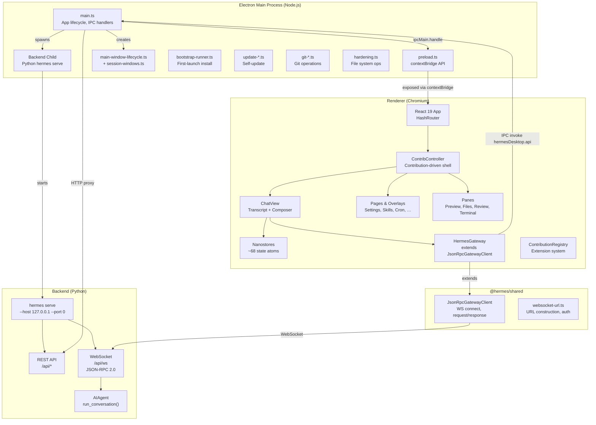
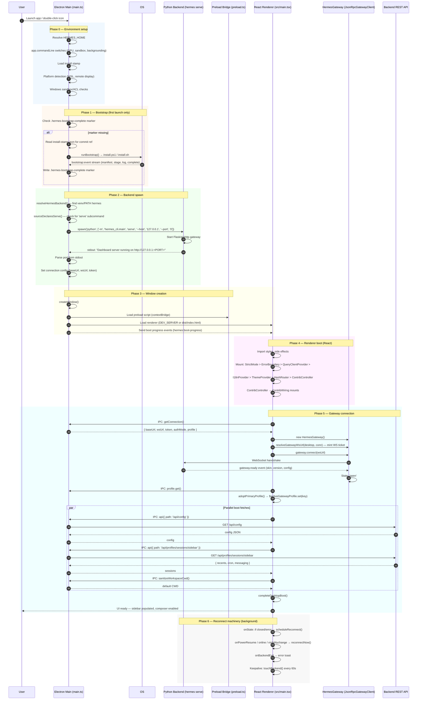

# Hermes Desktop — Architecture Document

> Reverse-engineered architecture doc. Read-only. No source code was modified.

---

## 1. High-Level Architecture

The desktop app is an **Electron + React** application that wraps the Hermes
agent backend (a Python process running `hermes serve`) in a native OS window.
It is **not** a thin webview of the dashboard — it has its own chat surface,
composer, slash-command pipeline, and session management.

### Process model

```
┌─────────────────────────────────────────────────────┐
│ Electron main process (Node.js)                      │
│                                                     │
│  ┌─ main.ts ─────────────────────────────────────┐  │
│  │  • App lifecycle (ready, quit, activate)       │  │
│  │  • Spawns backend child (Python hermes serve)  │  │
│  │  • Manages BrowserWindow(s)                    │  │
│  │  • ipcMain.handle handlers (~80 channels)      │  │
│  │  • File-system ops, git, clipboard, updates    │  │
│  │  • Connection config (local/remote/cloud)      │  │
│  │  • Profile-aware backend pool                  │  │
│  └────────────────────────────────────────────────┘  │
│                                                     │
│  ┌─ preload.ts (contextBridge) ───────────────────┐  │
│  │  • Narrow, typed bridge: ~80 IPC methods        │  │
│  │  • No Node/Electron access in renderer          │  │
│  │  • Event subscriptions (onBootProgress etc.)    │  │
│  └────────────────────────────────────────────────┘  │
│                                                     │
│  ┌─ Backend child (Python) ───────────────────────┐  │
│  │  • Spawned: hermes serve --host 127.0.0.1       │  │
│  │    --port 0 (dynamic port)                      │  │
│  │  • Provides: REST API + WebSocket (JSON-RPC)    │  │
│  │  • Owns: sessions, tools, model calls, memory   │  │
│  │  • One primary + optional per-profile pool       │  │
│  └────────────────────────────────────────────────┘  │
└─────────────────────────────────────────────────────┘
         │ IPC (invoke/handle + send/on)
         ▼
┌─────────────────────────────────────────────────────┐
│ Renderer process (Chromium sandbox)                  │
│                                                     │
│  React 19 + HashRouter                               │
│  ┌─ App Shell ────────────────────────────────────┐  │
│  │  titlebar | sidebar | workspace pane | rail     │  │
│  │  statusbar                                       │  │
│  └────────────────────────────────────────────────┘  │
│                                                     │
│  ┌─ ChatView ─────────────────────────────────────┐  │
│  │  ChatHeader | Thread (transcript)               │  │
│  │  ChatBar (composer + attachments + voice)       │  │
│  └────────────────────────────────────────────────┘  │
│                                                     │
│  ┌─ Pages: Skills, Messaging, Artifacts, Cron, … ─┐  │
│  ┌─ Overlays: Settings, CommandCenter, Profiles… ─┐  │
│  ┌─ Panes: Preview, Files, Review, Terminal ──────┐  │
│                                                     │
│  State: nanostores (~68 atoms in src/store/)         │
│  RPC:   WebSocket JSON-RPC to backend                │
│  REST:  HTTP via hermesDesktop.api() → main→backend  │
│  Contributed: registry (src/contrib/) for extensions │
└─────────────────────────────────────────────────────┘
```

### Key architectural principles

1. **Three authorities, clean seams:**
   - **Electron main** owns the machine: process lifecycle, native FS/git/windows, install/update.
   - **Renderer** owns the experience: navigation, presentation, interaction.
   - **Agent backend** owns the work: sessions, tools, model calls, streaming.
   
2. **Narrow waist.** The preload bridge exposes ~80 typed IPC methods. The
   renderer never reaches for Node or Electron directly. New capability arrives
   as a deliberate capability, not a general escape hatch.

3. **Server truth is cached, not owned.** The renderer's state is a cache of
   backend truth. It merges, reconciles, and rolls back on conflict — it
   never assumes it is authoritative.

4. **Profile-aware multi-backend.** The desktop can drive multiple Hermes
   profiles concurrently (one primary + a pool of secondary backends), each
   with its own WebSocket and REST routing.

5. **Contribution-driven shell.** The titlebar, statusbar, panes, keybinds,
   palette commands, and routes all register through a central
   `ContributionRegistry` — the same calls core surfaces and plugins use.

---

## 2. Startup Sequence

### Phase-by-phase execution

```
Phase 0: Environment
  electron/main.ts loads
  ├── app.commandLine.appendSwitch (GPU, sandbox, backgrounding)
  ├── resolveHermesHome() — determines HERMES_HOME
  ├── loadInstallStamp() — reads build stamp for bootstrap
  └── platform-specific prep (WSL fonts, sandbox markers, ACL repair)

Phase 1: Bootstrap (first launch only)
  ├── Bootstrap marker check: ~/.hermes/hermes-agent/.hermes-bootstrap-complete
  ├── If missing: runBootstrap() → install.ps1 / install.sh
  │   ├── Clone repo, create venv, pip install, npm install
  │   ├── Stream events to renderer (hermes:bootstrap:event)
  │   └── Write bootstrap-complete marker on success
  └── On failure: latch error, surface in desktop-install-overlay

Phase 2: Backend spawn
  app.whenReady() →
  ├── advanceBootProgress('hermes.resolve', 'Resolving Hermes backend…')
  ├── resolveHermesBackend() — finds hermes CLI in venv or PATH
  ├── sourceDeclaresServe() — detect hermes serve support
  │   └── Fallback: dashboardFallbackArgs() for older runtimes
  ├── spawn('python', ['-m', 'hermes_cli.main', 'serve', '--host', '127.0.0.1', '--port', '0'])
  │   └── Build env with PATH, HERMES_HOME, API keys
  └── waitForDashboardPortAnnouncement() — parse stdout for port

Phase 3: Window creation
  ├── createWindow() — BrowserWindow with transparent WCO titlebar
  │   ├── webPreferences: { preload, contextIsolation, sandbox, backgroundThrottling:false }
  │   ├── Load: DEV_SERVER ? http://127.0.0.1:5174 : file://dist/index.html
  │   └── Apply native theme, translucency, zoom from persisted state
  └── Register ~80 ipcMain.handle channels

Phase 4: Renderer boot
  src/main.tsx loads →
  ├── Import side effects: styles.css, store/translucency, clipboard shim
  ├── Mount React tree:
  │   StrictMode > ErrorBoundary > QueryClientProvider > I18nProvider >
  │   ThemeProvider > HapticsProvider > HashRouter > ContribController
  └── ContribController → ContribWiring mounts

Phase 5: Gateway connection (useGatewayBoot)
  ├── setDesktopBootStep('renderer.boot', 'Starting Hermes…', 6)
  ├── const gateway = new HermesGateway()  // extends JsonRpcGatewayClient
  ├── desktop.getConnection() → IPC → main process
  │   └── Main returns { baseUrl, wsUrl, token, authMode, profile, … }
  ├── resolveGatewayWsUrl(desktop, conn) — mint fresh WS ticket for OAuth
  ├── gateway.connect(wsUrl) — WebSocket handshake (15s timeout)
  ├── adoptPrimaryProfile() — read desktop.profile.get()
  ├── Parallel fetches:
  │   ├── seedDefaultCwd()
  │   ├── refreshHermesConfig() → /api/config
  │   └── refreshSessions() → /api/profiles/sessions/sidebar
  └── completeDesktopBoot() → UI interactive

Phase 6: Recovery & reconnect
  ├── onBootProgress → broadcast to renderer
  ├── onBackendExit → error toast
  ├── onPowerResume / online / visibilitychange → reconnectNow()
  ├── Reconnect backoff: 1s, 2s, 4s, … capped 15s
  └── After 6 consecutive fails → escalate to boot failure overlay
```

### Key files in execution order

| Order | File | Role |
|-------|------|------|
| 1 | `electron/main.ts` | Process entry: env, GPU, sandbox, bootstrap, spawn backend, create window |
| 2 | `electron/backend-command.ts` | Resolve backend argv (serve vs dashboard fallback) |
| 3 | `electron/backend-child.ts` | Platform-aware child process teardown |
| 4 | `electron/backend-ready.ts` | Parse stdout for dynamic port |
| 5 | `electron/backend-env.ts` | Build environment for backend child |
| 6 | `electron/connection-config.ts` | Auth modes, WS URL construction |
| 7 | `electron/main-window-lifecycle.ts` | Window create/focus/recreate guard |
| 8 | `electron/session-windows.ts` | Secondary window URL building + registry |
| 9 | `electron/preload.ts` | contextBridge: ~80 typed IPC methods |
| 10 | `electron/bootstrap-runner.ts` | First-launch install.ps1 runner |
| 11 | `electron/bootstrap-platform.ts` | Platform detection (WSL, remote display) |
| 12 | `dist/electron-main.mjs` | Bundled main (esbuild output) |
| 13 | `dist/electron-preload.js` | Bundled preload (esbuild output) |
| 14 | `src/main.tsx` | Renderer entry: providers, HashRouter, mount |
| 15 | `src/app/contrib/wiring.tsx` | useGatewayBoot + session wiring |
| 16 | `src/app/gateway/hooks/use-gateway-boot.ts` | Boot sequence, reconnect, profile adoption |
| 17 | `src/hermes.ts` | HermesGateway class + all REST API functions |
| 18 | `apps/shared/src/json-rpc-gateway.ts` | JsonRpcGatewayClient: WS connect, request/response, event dispatch |
| 19 | `apps/shared/src/websocket-url.ts` | WS URL construction, auth ticket minting |

---

## 3. Folder Responsibilities

### `electron/`

The **Electron main process**. All files run in a Node.js context with full
system access. Contains:

| File | Purpose |
|------|---------|
| `main.ts` | App entry (~3000+ lines): lifecycle, backend spawning, ~80 IPC handlers, window management, logging, updates, bootstrap, uninstall, preview, file ops, git ops, terminal PTY, clipboard, pet overlay, translucency, zoom |
| `preload.ts` | contextBridge exposing `window.hermesDesktop` — the ONLY surface renderer can call |
| `main-window-lifecycle.ts` | Pure function to ensure/restore the primary window |
| `backend-command.ts` | Resolve backend argv (`hermes serve` vs legacy `dashboard --no-open`) |
| `backend-child.ts` | Platform-aware process kill (SIGTERM vs taskkill /T) |
| `backend-env.ts` | Build environment for the spawned Python process |
| `backend-connection-state.ts` | State machine for backend child lifecycle |
| `backend-probes.ts` | Verify hermes CLI is importable |
| `backend-ready.ts` | Parse stdout for dynamic port announcement |
| `backend-start-failure.ts` | Latch logic to prevent respawn hot-loops |
| `connection-config.ts` | Auth mode resolution, WS URL building, connection scope |
| `dashboard-token.ts` | Adopt served dashboard token for API auth |
| `session-windows.ts` | Secondary window URL building + one-per-session registry |
| `bootstrap-runner.ts` | First-launch install.ps1 runner with event streaming |
| `bootstrap-platform.ts` | Platform detection (WSL, remote display, Windows binary path) |
| `update-*.ts` | Self-update: git fetch, rebuild, relaunch, progress, count |
| `updater-process.ts` | Spawn the Tauri updater subprocess |
| `windows-*.ts` | Windows-specific: sandbox fallback, system CA trust, env vars, child options, hermes path |
| `wsl-*.ts` | WSL-specific: clipboard images, path bridge |
| `git-*.ts` | Git operations: repos, worktrees, review (stage/unstage/diff/commit/push/PR) |
| `hardening.ts` | Path resolution security, file size caps, encryption |
| `workspace-cwd.ts` | Workspace directory resolution |
| `zoom.ts` | Window zoom persistence |
| `window-state.ts` | Window position/size save/restore |
| `titlebar-overlay-width.ts` | Native overlay width computation |
| `link-title-window.ts` | Fetch and cache page titles for link unfurling |
| `vscode-marketplace.ts` | Search/fetch VS Code themes |
| `desktop-uninstall.ts` | Uninstall logic (remove app, user data, agent) |
| `oauth-net-request.ts` | OAuth HTTP helpers |
| `profile-delete-routing.ts` | Decide which profile to activate after deletion |
| `fs-read-dir.ts` | Directory listing IPC |
| `git-repo-scan.ts` | Find git repos in a directory tree |
| `gateway-ws-probe.ts` | Probe WebSocket liveness |
| `spawn-helper-perms.ts` | Ensure spawn helper is executable |
| `embed-referer.ts` | Install embed referer handler |

All files have paired `*.test.ts` files.

### `src/`

The **Renderer process** — a React 19 application built with Vite.

| Subdirectory | Purpose |
|-------------|---------|
| `src/main.tsx` | React mount point: providers, HashRouter, error boundary |
| `src/hermes.ts` | `HermesGateway` class (extends JsonRpcGatewayClient) + all REST API functions (~1400 lines) |
| `src/hermes.test.ts` | Gateway unit tests |
| `src/styles.css` | Global CSS, theme tokens (`--ui-*`, `--shadow-nous`, `--stroke-nous`) |
| `src/global.d.ts` | TypeScript declarations for `window.hermesDesktop` |
| `src/types/hermes.ts` | All TypeScript types for API responses, events, session models |
| `src/app/` | **Page-level routes and feature modules** |
| `src/components/` | **Reusable React components** |
| `src/store/` | **Nanostores state atoms** (~68 stores) |
| `src/lib/` | **Pure utility functions** (no React dependency) |
| `src/contrib/` | **Plugin contribution system** (registry, slots, events) |
| `src/themes/` | Theme system (presets, VSCode import, user themes) |
| `src/i18n/` | Internationalization (en, ja, zh, zh-hant) |
| `src/hooks/` | Shared React hooks (mobile detection, resize observer, etc.) |
| `src/sdk/` | Desktop SDK entry point for external consumers |
| `src/fonts/` | JetBrains Mono webfont files |
| `src/plugins/` | Plugin README only |

### `public/`

Static assets served by Vite and bundled in the packaged app:
- `hermes.png`, `hermes-sprite.png` — brand images
- `apple-touch-icon.png` — app icon
- `hermes-frames/` — 8-frame animated sprite sequence
- `ds-assets/` — filler background images

### `scripts/`

Build and development tooling (Node.js `.mjs` scripts):

| Script | Purpose |
|--------|---------|
| `bundle-electron-main.mjs` | esbuild bundler for electron/ → dist/electron-main.mjs |
| `before-build.mjs` | Pre-build checks |
| `before-pack.mjs` | Pre-pack checks for electron-builder |
| `after-pack.mjs` | Post-pack (set executable identity on macOS) |
| `write-build-stamp.mjs` | Write install-stamp.json (commit, branch, timestamp) |
| `stage-native-deps.mjs` | Copy native .node addons into dist/ |
| `rebuild-native.mjs` | Rebuild native modules against Electron's Node |
| `run-electron-builder.mjs` | Launch electron-builder with memory limits |
| `notarize.mjs` | macOS notarization |
| `patch-electron-builder-mac-binary.mjs` | Patch electron-builder binary on macOS |
| `test-desktop.mjs` | Integration test runner for packaged desktop builds |
| `assert-dist-built.mjs` | Verify dist/ output exists |
| `assert-root-install.mjs` | Verify root node_modules exist |
| `dev-no-hmr.mjs` | Dev mode without HMR |
| `reload.mjs`, `reload-renderer.mjs` | Live-reload helpers |
| `measure-*.mjs`, `profile-*.mjs` | Performance measurement scripts |
| `gen-share-codes.ts` | Generate star map share codes |
| `leak-typing.mjs` | Typing latency measurement |
| `eval.mjs` | Arbitrary eval in main process context |
| `diag-*.mjs` | Diagnostic utilities |
| `utils.mjs` | Shared script utilities |

---

## 4. Main Modules

### `electron/main.ts`

The **load-bearing module** — the entire Electron main process (3000+ lines).
Responsibilities:

- **App lifecycle:** `app.whenReady()`, `app.on('window-all-closed')`, `app.on('activate')`
- **Platform prep:** GPU detection, remote display fallback, WSL GPU passthrough, Windows sandbox recovery, font setup, logging rotation
- **Backend management:** Resolve hermes CLI, spawn `hermes serve`, wait for port, manage primary + pool backends, LRU eviction, idle reaping
- **Window management:** Create BrowserWindow (transparent titlebar, vibrancy, translucency), secondary session windows, pet overlay window, link title window
- **IPC handlers (~80 channels):** connection management, boot progress, bootstrap events, REST API proxy, file system, git, terminal PTY, clipboard, notifications, zoom, themes, updates, uninstall, profile, cloud, preview
- **Persisted state:** connection.json, updates.json, window-state.json, active-profile.json, native-theme.json, translucency.json

### `electron/preload.ts`

The **security boundary** between main and renderer. Uses `contextBridge.exposeInMainWorld` to define `window.hermesDesktop` — a narrow, typed API with ~80 methods:

- **Connection:** `getConnection(profile)`, `revalidateConnection()`, `getGatewayWsUrl(profile)`
- **Boot/bootstrap:** `getBootProgress()`, `getBootstrapState()`, `cancelBootstrap()`, `onBootProgress(cb)`
- **REST proxy:** `api(request)` → main process → backend HTTP
- **File system:** `readDir()`, `gitRoot()`, `revealPath()`, `renamePath()`, `writeTextFile()`, `trashPath()`
- **Git:** `worktreeList/Add/Remove`, `branchSwitch/List`, `repoStatus`, `fileDiff`, `review.*`
- **Terminal:** `start(options)`, `write(id, data)`, `resize(id, size)`, `onData(id, cb)`, `onExit(id, cb)`
- **Clipboard:** `writeClipboard(text)`, `saveClipboardImage()`
- **Media:** `readFileDataUrl()`, `saveImageFromUrl()`, `saveImageBuffer()`
- **UI:** `setTitleBarTheme()`, `setNativeTheme()`, `setTranslucency()`, `openExternal(url)`
- **Updates:** `check()`, `apply()`, `getBranch()`, `setBranch()`, `onProgress(cb)`
- **Profile:** `get()`, `set(name)`
- **Events:** `onBackendExit(cb)`, `onPowerResume(cb)`, `onConnectionApplied(cb)`, `onDeepLink(cb)`, `onWindowStateChanged(cb)`, `onFocusSession(cb)`, `onPreviewFileChanged(cb)`

### `electron/main-window-lifecycle.ts`

A pure function that ensures the primary window exists and is focused:

```typescript
ensureMainWindow(window, { isReady, createWindow, focusWindow })
```

If the window is destroyed/null and the app is ready, it creates a new one.
Otherwise it focuses the existing window. Injected so it can be unit-tested.

### `electron/backend-child.ts`

Platform-aware backend process teardown:
- **POSIX (macOS/Linux/WSL):** `child.kill('SIGTERM')`
- **Windows:** `taskkill /T /F /PID <pid>` (tree-kill, so grandchildren like PTY sessions are also terminated)

Dependency-free (no Electron import) so it can be unit-tested with a fake child object.

### `electron/backend-command.ts`

Resolves the backend subcommand. The desktop always prefers `hermes serve --host 127.0.0.1 --port 0`, but falls back to `hermes dashboard --no-open` for older runtimes that predate the `serve` subcommand. The fallback detection reads the Python source of `dashboard.py` to check for `add_parser("serve")`.

### `electron/session-windows.ts`

Manages **secondary OS windows** for individual chat sessions (cmd-click pop-out, subagent watch windows). Provides:

- `chatWindowWebPreferences(preloadPath)` — shared settings for ALL windows (backgroundThrottling: false is load-bearing for live streaming)
- `buildSessionWindowUrl(sessionId, opts)` — builds the URL with `?win=secondary`, `&new=1`, `&watch=1` flags
- `createSessionWindowRegistry()` — Map-based registry ensuring one window per session; focuses existing instead of duplicating

---

## 5. Data Flow

### User message: UI → Backend → UI

```
USER TYPES IN COMPOSER (ChatBar)
  │
  ├─ RichEditor (contentEditable div) captures input
  ├─ Attachments: images, file refs, URLs
  ├─ Slash commands & @-completions via popover
  │
  ▼
SUBMIT (Enter, or click Send)
  │
  ├─ useSubmitPrompt() in src/app/session/hooks/use-prompt-actions/submit.ts
  │   ├─ sanitizeComposerInput(text)
  │   ├─ terminalContextBlocksFromDraft(text)
  │   ├─ Sync attachments → file.attach RPC (rewrites @file: refs)
  │   ├─ Create/get session: session.resume or session.create
  │   └─ requestGateway('prompt.submit', { session_id, text })
  │
  ▼
HermesGateway.request(method, params)
  │  (extends JsonRpcGatewayClient from @hermes/shared)
  │
  ├─ socket.send(JSON.stringify({ jsonrpc: '2.0', id, method, params }))
  │
  ▼
WEBSOCKET ───────────────────────────────────────────► PYTHON BACKEND
  │                                                      │
  │   JSON-RPC over WebSocket                             ├─ hermes serve gateway
  │   @ 127.0.0.1:<dynamic-port>/api/ws                   ├─ gw.prompt_submit()
  │                                                       ├─ AIAgent.run_conversation()
  │                                                       ├─ Model API calls
  │                                                       └─ Tool execution
  │                                                      │
  │   ◄─── STREAMING EVENTS ──────────────────────────── │
  │                                                      │
  ▼
JsonRpcGatewayClient.handleMessage(raw)
  │
  ├─ Parse JSON: { method: 'event', params: { type, payload, session_id } }
  ├─ If frame.id → resolve pending request promise
  ├─ If frame.method === 'event' → dispatchEvent()
  │
  ▼
handleGatewayEvent(event) in wiring.tsx  (useGatewayBoot callback)
  │
  ├─ Switch on event.type:
  │
  │   thinking.delta ───► append to session's thinking stream
  │   message.delta ────► append text delta to last assistant message
  │                        (replaces $messages atom ~30×/s during streaming)
  │   message.start ────► create new assistant message placeholder
  │   message.complete ─► finalize assistant message, clear streaming state
  │   reasoning.delta ──► append reasoning content (thinking tag content)
  │
  │   tool.start ───────► create tool-call message with spinner
  │   tool.progress ────► update tool-call with partial output
  │   tool.complete ────► finalize tool-call result
  │
  │   clarify.request ──► show clarify prompt overlay
  │   approval.request ─► show approval prompt overlay
  │   sudo.request ─────► show sudo password prompt
  │   secret.request ───► show secret input prompt
  │
  │   status.update ────► update session status (tokens, cost, iteration)
  │   background.complete► notify background delegation finished
  │   gateway.ready ────► initial handshake (skin, version, config)
  │
  │   session.info ─────► update session metadata (title, model, provider)
  │
  └─ Each handler updates relevant nanostores
     │
     ▼
NANOSTORES (reactive state atoms)
  │
  ├─ $messages.set([...updated messages])
  ├─ setBusy(true/false)
  ├─ $sessionTodos.set(...)
  ├─ $toolDiffs.set(...)
  │
  ▼
REACT COMPONENTS RE-RENDER
  │
  ├─ Thread (transcript) — subscribes to messages via useSessionView().$messages
  │   ├─ assistant-ui Message components
  │   ├─ MarkdownText, AnsiText, CodeCard
  │   ├─ Tool fallback cards (approval, clarify, generated images)
  │   └─ Streaming text updates in real time
  │
  ├─ StatusStack — subscribes to $sessionTodos, coding status
  ├─ PreviewPane — subscribes to $previewTarget
  ├─ Sidebar — subscribes to $sessions
  └─ Titlebar — subscribes to $currentCwd, $selectedStoredSessionId
```

### REST data flow

```
RENDERER                  MAIN PROCESS               BACKEND (Python)
  │                         │                          │
  │ hermesDesktop.api({     │                          │
  │   path: '/api/config',  │                          │
  │   method: 'GET'         │                          │
  │ })                      │                          │
  │──── IPC invoke ────────►│                          │
  │                         │ http.request(            │
  │                         │   { host, port, path })  │
  │                         │─────────────────────────►│
  │                         │                          │ /api/config handler
  │                         │◄─────────────────────────│
  │◄── IPC response ───────│                          │
  │                         │                          │
```

The main process proxies all REST calls. For OAuth (remote) mode, it handles
cookie-based session auth. For token mode, the token is passed as a query
parameter. Profile-scoped calls (`profile` field in the request) route to the
correct backend child in the pool.

### Event push flow

```
BACKEND                     MAIN PROCESS               RENDERER
  │                           │                          │
  │ (no direct channel)       │ child.on('exit')         │
  │                           │ webContents.send(        │
  │                           │   'hermes:backend-exit') │
  │                           │─────────────────────────►│
  │                           │                          │ onBackendExit(cb)
  │                           │                          │
  │                           │ powerMonitor.on('resume')│
  │                           │ webContents.send(        │
  │                           │   'hermes:power-resume')│
  │                           │─────────────────────────►│
  │                           │                          │ onPowerResume(cb)
  │                           │                          │
  │                           │ (boot progress)          │
  │                           │ broadcastBootProgress()  │
  │                           │ webContents.send(        │
  │                           │   'hermes:boot-progress')│
  │                           │─────────────────────────►│
  │                           │                          │ onBootProgress(cb)
```

---

## 6. Mermaid Architecture Diagram



---

## 7. Mermaid Startup Sequence Diagram



---

## 8. Subsystem Inventory

### Electron Main Process Subsystems

| Subsystem | Files | Description |
|-----------|-------|-------------|
| **App bootstrap** | `main.ts`, `bootstrap-runner.ts`, `bootstrap-platform.ts` | First-launch install.ps1 runner, platform detection |
| **Backend lifecycle** | `main.ts`, `backend-command.ts`, `backend-child.ts`, `backend-env.ts`, `backend-ready.ts`, `backend-connection-state.ts`, `backend-start-failure.ts`, `backend-probes.ts` | Spawn, monitor, kill Python backend; resolve command; build env |
| **Connection config** | `connection-config.ts`, `dashboard-token.ts`, `gateway-ws-probe.ts`, `oauth-net-request.ts` | Auth mode (local/remote/cloud/oauth), WS URL, HTTP probe |
| **Window management** | `main-window-lifecycle.ts`, `session-windows.ts`, `window-state.ts`, `zoom.ts`, `titlebar-overlay-width.ts`, `link-title-window.ts` | Primary + secondary windows, position/size persistence, zoom |
| **Self-update** | `update-remote.ts`, `update-count.ts`, `update-marker.ts`, `update-rebuild.ts`, `update-relaunch.ts`, `updater-process.ts` | Git-based self-update pipeline |
| **Uninstall** | `desktop-uninstall.ts` | Remove app bundle, user data, agent |
| **File system IPC** | `hardening.ts`, `fs-read-dir.ts`, `workspace-cwd.ts`, `wsl-path-bridge.ts` | Path security, directory listing, CWD resolution |
| **Git IPC** | `git-root.ts`, `git-repo-scan.ts`, `git-review-ops.ts`, `git-worktree-ops.ts` | Git operations exposed to renderer |
| **Terminal PTY** | `main.ts` (terminal handlers), `node-pty` | PTY terminal sessions via node-pty |
| **Platform hardening** | `windows-sandbox-fallback.ts`, `windows-system-ca.ts`, `windows-user-env.ts`, `windows-child-options.ts`, `windows-hermes-path.ts`, `wsl-clipboard-image.ts` | OS-specific recovery and integration |
| **Profile routing** | `profile-delete-routing.ts`, per-profile backend pool (in main.ts) | Multi-profile backend routing, LRU eviction |
| **Embed/preview** | `embed-referer.ts` | Local preview file watching |
| **VSCode themes** | `vscode-marketplace.ts` | Search/fetch themes from VSCode marketplace |
| **Electron desktop pin** | `desktop-electron-pin.test.ts` | Tests for pinned self-update behavior |

### Renderer Subsystems

| Subsystem | Key Files | Description |
|-----------|-----------|-------------|
| **Gateway boot** | `src/app/gateway/hooks/use-gateway-boot.ts` | Primary boot sequence, reconnect, multi-profile gateway routing |
| **Gateway RPC** | `src/hermes.ts`, `apps/shared/src/json-rpc-gateway.ts` | WebSocket JSON-RPC client, HermesGateway subclass, REST API functions |
| **Gateway store** | `src/store/gateway.ts` | Multi-profile gateway registry (primary + secondary sockets) |
| **Chat transcript** | `src/app/chat/index.tsx`, `src/components/assistant-ui/thread/`, `src/app/chat/hooks/` | Thread rendering, message streaming, tool results |
| **Composer** | `src/app/chat/composer/` | Rich text input, attachments, slash/@-completions, voice, queue, pop-out |
| **Prompt actions** | `src/app/session/hooks/use-prompt-actions/` | Submit pipeline, rewind, slash commands, optimistic messages |
| **Session management** | `src/store/session.ts`, `src/app/session/hooks/` | Session list, resume, state cache, multi-profile routing |
| **Sidebar** | `src/app/chat/sidebar/` | Session list, profile switcher, projects, ordering |
| **Route pages** | `src/app/settings/`, `src/app/skills/`, `src/app/messaging/`, `src/app/artifacts/`, `src/app/cron/`, `src/app/profiles/`, `src/app/agents/`, `src/app/starmap/` | Full-page destinations |
| **Overlays** | `src/app/command-center/`, `src/app/command-palette/`, `src/app/overlays/` | Overlay cards (command palette, session picker, model picker) |
| **Panes** | `src/app/right-sidebar/`, `src/app/right-sidebar/files/`, `src/app/right-sidebar/review/`, `src/app/right-sidebar/terminal/` | Preview, files, review, terminal panes |
| **Pane layout** | `src/components/pane-shell/tree/` | Grid-based pane layout engine, drag-and-drop, presets |
| **Shell chrome** | `src/app/shell/` | Titlebar, statusbar, model menu, gateway menu, context usage |
| **State stores** | `src/store/` (68 files) | Nanostores atoms: session, composer, gateway, preview, todos, pet, tool-diffs, zoom, updates, onboarding, profile, layout, etc. |
| **Query layer** | `src/lib/query-client.ts` | @tanstack/react-query for server-state caching |
| **Message streaming** | `src/app/session/hooks/use-message-stream/` | Handle gateway streaming events, mutate message state |
| **Theme system** | `src/themes/`, `src/store/translucency.ts`, `src/store/zoom.ts` | Theme tokens, VSCode import, skin engine bridge, translucency |
| **i18n** | `src/i18n/` | Four locales (en, ja, zh, zh-hant), pluralization, interpolation |
| **Keybinds** | `src/lib/keybinds/`, `src/store/keybinds.ts`, `src/app/hooks/use-keybinds.ts` | Rebinding key system |
| **Notifications** | `src/store/notifications.ts`, `src/store/native-notifications.ts`, `src/components/notifications.tsx` | Toast + OS notification system |
| **Pet system** | `src/store/pet.ts`, `src/store/pet-overlay.ts`, `src/components/pet/`, `src/app/pet-overlay/`, `src/app/pet-generate/` | Floating pet companion, overlay window, generation UI |
| **Preview** | `src/store/preview.ts`, `src/store/preview-status.ts`, `src/store/preview-edit.ts`, `src/app/chat/right-rail/preview*.tsx` | File preview pipeline (local + remote) |
| **Onboarding** | `src/store/onboarding.ts`, `src/components/onboarding/` | Desktop onboarding flow |
| **Boot overlays** | `src/components/boot-failure-overlay.tsx`, `src/components/boot-failure-reauth.ts`, `src/components/gateway-connecting-overlay.tsx`, `src/components/desktop-install-overlay.tsx` | Boot states: connecting, install, failure, reauth |
| **Background delegation** | `src/store/background-delegation.ts` | Track background delegate_task completions |
| **Composer queue** | `src/store/composer-queue.ts` | Queue sends for re-delivery when gateway is busy |
| **Session states** | `src/store/session-states.ts` | Track working/attention session IDs for gateway pool |
| **External store runtime** | `src/lib/incremental-external-store-runtime.ts` | Bridge nanostores → @assistant-ui runtime |
| **Markdown rendering** | `src/lib/markdown-blocks.ts`, `src/lib/markdown-code.ts`, `src/lib/markdown-preprocess.ts` | Custom markdown with KaTeX math, Mermaid diagrams, code highlighting |
| **Slash commands** | `src/lib/desktop-slash-commands.ts` | Curated slash commands for desktop with block-lists |
| **Tool diffs** | `src/store/tool-diffs.ts` | Unified diff tracking for tool outputs |
| **Voice** | `src/app/chat/composer/hooks/use-composer-voice.ts`, `src/app/chat/composer/hooks/use-voice-recorder.ts`, `src/app/chat/composer/hooks/use-voice-conversation.ts`, `src/store/voice-prefs.ts`, `src/store/voice-playback.ts` | Voice recording, transcription, TTS |
| **Clipboard** | `src/lib/clipboard.ts` | Clipboard shim for sandboxed renderer |
| **Haptics** | `src/lib/haptics.ts`, `src/store/haptics.ts`, `src/components/haptics-provider.tsx` | Haptic feedback (macOS trackpad) |
| **Animations** | `src/components/particles/`, motion library usage | Particle effects, transitions |
| **Completion sound** | `src/lib/completion-sound.ts`, `src/store/completion-sound.ts` | Play sound on turn completion |
| **Connection config UI** | `src/app/settings/gateway-settings.tsx`, `src/app/settings/connection-config*.ts` | Gateway connection mode settings |
| **Model picker** | `src/app/model-picker-overlay.tsx`, `src/app/model-visibility-overlay.tsx`, `src/store/model-presets.ts`, `src/store/model-visibility.ts` | Model selection overlays |
| **Encoding status** | `src/store/coding-status.ts` | Real-time coding activity indicator |
| **Starmap** | `src/app/starmap/` | Visual conversation graph (D3 force layout) |
| **Learning graph** | `src/hermes.ts` (getStarmapGraph, getLearningNode, etc.) | Backend-driven knowledge graph |
| **Billing** | `src/app/settings/billing/` | Usage billing UI (Nous cloud) |
| **Memory** | `src/app/settings/memory/` | Memory provider configuration |
| **Hub** | `src/app/skills/hub.tsx`, hermes.ts hub functions | Skills hub search, preview, install |
| **SDK** | `src/sdk/` | External plugin SDK entry |
| **Dashboard OAuth** | `src/lib/mcp-dashboard-oauth.ts` | OAuth flows for MCP through main process |
| **Workspace/projects** | `src/store/projects.ts`, `src/app/chat/sidebar/projects/` | Project folders, worktrees |
| **Session export** | `src/lib/session-export.ts` | Export sessions as markdown |
| **Session search** | `src/lib/session-search.ts` | FTS5 search via backend |
| **Log viewer** | `src/components/chat/log-tail.tsx`, `src/hermes.ts` getLogs() | Real-time log streaming |
| **System actions** | `src/store/system-actions.ts` | Track running actions (doctor, backup, audit) |

---

## 9. Extension Points

These are the approved extension surfaces where new functionality can be added
**without modifying core architecture**. Listed in order of increasing
footprint:

### 1. Contributed routes (plugin pages)

**Surface:** `src/app/routes.ts` — `ROUTES_AREA` + `SIDEBAR_NAV_AREA`

A plugin registers a full-page route by contributing to the `routes` area with a
`path` and `render()` function. A companion `sidebar.nav` contribution adds a
nav row to the sidebar. The contributed page gets its own view (`extension`) in
the app shell.

```typescript
// Example: a kanban board plugin
registry.register({
  area: 'routes',
  id: 'kanban.page',
  data: { path: '/kanban' },
  render: () => <KanbanPage />
})
registry.register({
  area: 'sidebar.nav',
  id: 'kanban.nav',
  data: { codicon: 'project', label: 'Kanban', path: '/kanban' }
})
```

### 2. Pane contributions

**Surface:** `src/components/pane-shell/tree/` — `declareDefaultTree()`, `watchContributedPanes()`

Plugins can register panes that users can open in the workspace grid layout.
Each pane declares a `placement` (left/right), `tabName`, and render function.

### 3. Titlebar and statusbar slots

**Surface:** `src/contrib/react/slot.tsx` — `<ContribSlot area="titleBar.left" />`

The titlebar renders left/right `<Slot>` components. Plugins register
contributions to these areas to add buttons or indicators.

### 4. Statusbar data contributions

**Surface:** `src/app/shell/statusbar-controls.tsx` — statusbar items

Register data contributions with a `StatusbarItem` payload to add rows to the
statusbar. Used for connection status, model info, token usage.

### 5. Composer middleware

**Surface:** `src/app/chat/composer/contrib.ts` — `COMPOSER_AREAS`

The composer supports middleware slots for preprocessing, postprocessing, and
decorating the input area.

### 6. Command palette contributions

**Surface:** `src/app/command-palette/contrib.ts` — `PALETTE_AREA`

Register commands into the ⌘K command palette. Each contribution gets a label,
codicon, hotkey, and action callback.

### 7. Keybind contributions

**Surface:** `src/lib/keybinds/actions.ts` — `KEYBINDS_AREA`

Register global hotkey actions with defaults, labels, and callbacks. Users can
rebind them in settings.

### 8. Plugin REST and WebSocket doors

**Surface:** `src/hermes.ts` — `pluginRest()`, `pluginSocket()`

Plugins get namespace-scoped REST and WebSocket access through the desktop
bridge. REST calls are profile-aware and routed to the correct backend.
WebSocket connections auto-reconnect.

```typescript
// Namespace-scoped: /api/plugins/<pluginId>/<path>
const board = await pluginRest<Board>('kanban', '/board')
const unsub = pluginSocket('kanban', '/events', data => { ... })
```

### 9. Bundled plugins (discovery)

**Surface:** `src/contrib/plugins.ts` — `discoverBundledPlugins()`

Plugins placed in `src/plugins/<name>/` with a TypeScript module are discovered
at build time and bundled with the app.

### 10. Runtime plugins (external)

**Surface:** `src/contrib/runtime-loader.ts` — `discoverRuntimePlugins()`

External plugins installed at `~/.hermes/plugins/` are discovered at runtime.
They can register contributions, tools, and hooks through the same registry API.

### 11. CLI commands (via backend)

New capabilities that don't need a UI can be added as `hermes` CLI commands
with a companion skill. The desktop app's agent runs these via the `terminal`
tool or as slash commands.

### 12. Electron IPC handlers

**Surface:** `electron/main.ts` — `ipcMain.handle()`

New native capabilities (file system, OS integration) can be added as new IPC
channels. Each requires a handler in main.ts and a corresponding method in
`preload.ts`. This is the widest extension point and should be used sparingly.

### Architecture boundaries (do not cross)

- The renderer must **never** import `electron`, `fs`, `path`, `child_process`, or any Node built-in.
- All native access goes through the preload bridge.
- Agent behavior lives behind the gateway — never reimplemented in React.
- Plugins share the contribution registry; they do not create separate extension systems.
- A new global store is a claim that many distant surfaces need it — earn that claim.
